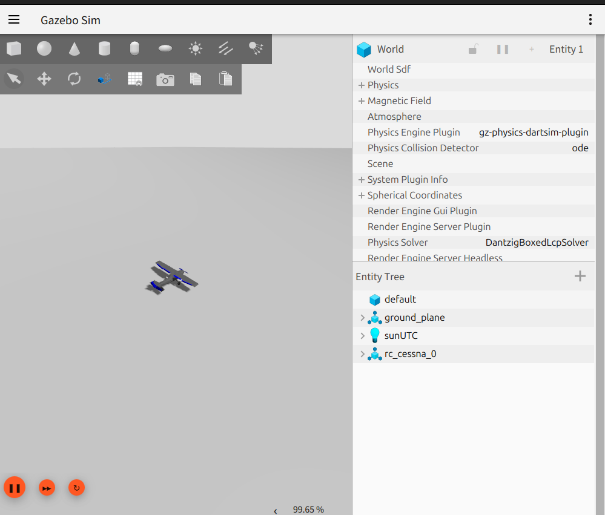

# PX4 SITL + Gazebo Harmonic 固定翼模擬環境

Ubuntu 24.04 上的 PX4 SITL 開發環境，搭配 Gazebo Harmonic 模擬器，用於固定翼無人機模擬。

## Gazebo Sim 模擬畫面



Gazebo Harmonic 模擬器中的 RC Cessna 固定翼飛機模型。右側面板顯示 World 設定（物理引擎：gz-physics-dartsim-plugin、碰撞偵測：ODE）以及 Entity Tree 中的場景元素（ground_plane、sunUTC、rc_cessna_0）。

## 快速啟動

```bash
# 啟動 RC Cessna（預設）
./start-sitl.sh

# 啟動進階固定翼
./start-sitl.sh advanced_plane

# 無 GUI 模式
HEADLESS=1 ./start-sitl.sh
```

或直接使用 make：

```bash
cd PX4-Autopilot
make px4_sitl gz_rc_cessna
```

## 可用的固定翼 Make Target

| Target | 說明 |
|---|---|
| `gz_rc_cessna` | RC Cessna 小型飛機 |
| `gz_advanced_plane` | 進階固定翼飛機 |

## PX4 SITL Shell 常用指令

SITL 啟動後會進入 PX4 shell（`pxh>`），可使用以下指令：

```bash
# 起飛 / 降落
commander takeoff
commander land

# 查看感測器狀態
sensor_accel_sim status
sensor_gyro_sim status

# 查看飛行模式
commander status

# GPS 狀態
gps status
```

## 環境變數

| 變數 | 用途 | 範例 |
|---|---|---|
| `HEADLESS=1` | 不啟動 Gazebo GUI | `HEADLESS=1 make px4_sitl gz_rc_cessna` |
| `PX4_GZ_WORLD=windy` | 指定 Gazebo 世界場景 | 模擬風場環境 |
| `PX4_SIM_SPEED_FACTOR=2` | 加速模擬 | 2 倍速運行 |
| `PX4_HOME_LAT` | 起飛緯度 | `PX4_HOME_LAT=25.034` |
| `PX4_HOME_LON` | 起飛經度 | `PX4_HOME_LON=121.564` |
| `PX4_HOME_ALT` | 起飛高度 (m) | `PX4_HOME_ALT=10` |

## QGroundControl 地面站

```bash
./QGroundControl-x86_64.AppImage
```

QGC 會自動透過 UDP 14550 連接到 PX4 SITL，無需額外設定。

## 驗證步驟

1. `make px4_sitl gz_rc_cessna` → Gazebo 視窗出現 Cessna 模型
2. PX4 shell 中 `commander takeoff` → 飛機起飛
3. 啟動 QGroundControl → 自動連接，顯示飛機位置和狀態
4. `commander land` → 飛機降落

## 飛控核心原理：PID 控制器

PX4 的飛行控制核心是 **PID 控制器**。無論是維持高度、控制航向還是穩定姿態，背後都是 PID 在運作。

### 什麼是 PID？

PID 是三個詞的縮寫，分別代表三種「修正力道」：

```
修正量 = P（比例）+ I（積分）+ D（微分）
```

用一個生活化的例子來理解——假設你在開車，目標是維持時速 100 km/h：

| 項目 | 全名 | 做什麼 | 開車的比喻 |
|---|---|---|---|
| **P** | Proportional（比例） | 看「現在差多少」來修正 | 現在 80，差 20，大力踩油門 |
| **I** | Integral（積分） | 看「過去累積的誤差」來修正 | 一直維持在 98，差 2 卻修不回來，慢慢加力 |
| **D** | Derivative（微分） | 看「誤差變化的速度」來修正 | 速度正在快速上升，先鬆油門避免衝過頭 |

### PID 公式

```
u(t) = Kp × e(t) + Ki × ∫e(t)dt + Kd × de(t)/dt
```

其中：
- `e(t)` = 目標值 - 實際值（誤差）
- `Kp` = 比例增益（反應強度）
- `Ki` = 積分增益（消除長期偏差）
- `Kd` = 微分增益（抑制震盪）

### PX4 中的 PID 架構

PX4 固定翼使用**串級 PID**（Cascade PID），外環的輸出作為內環的目標值：

```
                    ┌─────────────┐     ┌─────────────┐
目標航向 ──→ │  外環（導航）  │──→  │  內環（姿態）  │──→ 舵面輸出
                    │  位置 → 姿態  │     │  姿態 → 角速度 │
                    └─────────────┘     └─────────────┘
```

- **外環（Position/Navigation）**：比較目標位置與 GPS 位置，算出需要的傾斜角度
- **內環（Attitude/Rate）**：比較目標角度與 IMU 實際角度，算出舵面偏轉量

### PID 調校技巧（固定翼）

#### 調校順序（由內而外）

> 先穩定內環，再調外環。如果內環不穩，外環怎麼調都沒用。

1. **Rate Controller（角速度環）** → 最內層，先調
2. **Attitude Controller（姿態環）** → 中間層
3. **Position Controller（位置環）** → 最外層，最後調

#### 各軸參數對照

| 軸 | 控制什麼 | PX4 參數前綴 | 舵面 |
|---|---|---|---|
| Roll | 滾轉（左右傾斜） | `FW_RR_` / `FW_R_` | 副翼 (Aileron) |
| Pitch | 俯仰（抬頭低頭） | `FW_PR_` / `FW_P_` | 升降舵 (Elevator) |
| Yaw | 偏航（左右轉向） | `FW_YR_` / `FW_Y_` | 方向舵 (Rudder) |

#### 逐步調校法

```
步驟 1：先只調 P（把 I 和 D 設為 0）
  → 慢慢加大 Kp，直到飛機能回到目標但會輕微震盪

步驟 2：加入 D 來抑制震盪
  → 慢慢加大 Kd，直到震盪消失，回復平滑

步驟 3：加入 I 來消除穩態誤差
  → 慢慢加大 Ki，讓飛機精確到達目標值
  → Ki 太大會造成「積分飽和」（overshooting）
```

#### 常見症狀與對策

| 症狀 | 可能原因 | 調整方向 |
|---|---|---|
| 持續震盪（快速抖動） | P 太大 | 降低 Kp |
| 緩慢震盪（大幅擺動） | D 太小或 P 太大 | 增加 Kd 或降低 Kp |
| 反應遲鈍，回不到目標 | P 太小 | 增加 Kp |
| 穩定但有固定偏差 | 缺少 I | 增加 Ki |
| 衝過目標再拉回（overshoot） | I 太大或 D 太小 | 降低 Ki 或增加 Kd |

#### 在 SITL 中調參

```bash
# 在 PX4 shell (pxh>) 中即時修改參數
param set FW_RR_P 0.05      # Roll Rate P 增益
param set FW_RR_I 0.01      # Roll Rate I 增益
param set FW_RR_D 0.003     # Roll Rate D 增益

# 查看當前值
param show FW_RR_*

# 儲存參數（重啟後保留）
param save
```

也可以在 QGroundControl 的 **Vehicle Setup → Parameters** 中用 GUI 調整。

---

## 飛控核心原理：Kalman Filter（卡爾曼濾波器）

### 為什麼需要 Kalman Filter？

無人機上有很多感測器，但每個都有缺點：

| 感測器 | 量測什麼 | 優點 | 缺點 |
|---|---|---|---|
| **IMU**（加速度計+陀螺儀） | 姿態、角速度 | 反應快（高頻） | 會漂移（drift），長期不準 |
| **GPS** | 位置、速度 | 長期穩定，不會漂移 | 更新慢（低頻）、有雜訊 |
| **氣壓計** | 高度 | 不需外部訊號 | 受天氣影響，精度有限 |
| **磁力計** | 航向（指北） | 提供絕對方向 | 易受電磁干擾 |

**問題**：如果只信任一個感測器，要嘛短期不準，要嘛長期漂移。

**解法**：Kalman Filter 把所有感測器的資料「聰明地融合」在一起，取各家之長。

### Kalman Filter 的核心思想

Kalman Filter 不斷重複兩個步驟：

```
┌──────────────────────────────────────────────────┐
│                                                  │
│   ① 預測（Predict）                               │
│   用上一步的狀態 + 物理模型，預估「現在應該在哪」       │
│                                                  │
│              ↓                                   │
│                                                  │
│   ② 更新（Update）                                │
│   拿到感測器資料後，比較「預測值」與「量測值」          │
│   根據各自的可信度（不確定性）加權融合                  │
│                                                  │
│              ↓                                   │
│                                                  │
│   輸出：最佳估計值（融合後的狀態）                     │
│   然後回到 ①                                      │
│                                                  │
└──────────────────────────────────────────────────┘
```

### 直覺理解：兩個朋友報路

想像你閉著眼睛走路，有兩個朋友幫你導航：

- **朋友 A（IMU）**：每秒告訴你 10 次方向，但他近視，走久了會偏
- **朋友 B（GPS）**：每秒只告訴你 1 次位置，但他看得很準

Kalman Filter 就是：
1. **大部分時間聽 A**（靠 IMU 快速反應）
2. **每當 B 說話時，修正 A 的偏差**（用 GPS 校正漂移）
3. **如果 B 突然說了一個很離譜的值**（GPS 跳點），就少信他一點

這個「信任比例」就是 **Kalman Gain（卡爾曼增益）**。

### 數學概念（簡化版）

```
預測步驟：
  x̂⁻ = F × x̂ + B × u        ← 根據物理模型預測下一狀態
  P⁻  = F × P × Fᵀ + Q       ← 預測的不確定性會增加

更新步驟：
  K  = P⁻ × Hᵀ / (H × P⁻ × Hᵀ + R)   ← Kalman Gain
  x̂  = x̂⁻ + K × (z - H × x̂⁻)          ← 融合量測值修正
  P  = (I - K × H) × P⁻                 ← 更新不確定性
```

| 符號 | 意義 | 白話 |
|---|---|---|
| `x̂` | 狀態估計 | 我們認為飛機在哪、飛多快 |
| `P` | 不確定性（協方差） | 我們對估計有多沒把握 |
| `F` | 狀態轉移矩陣 | 物理模型（如何從上一刻推算下一刻） |
| `z` | 量測值 | 感測器讀數 |
| `H` | 觀測矩陣 | 感測器量的是狀態中的哪個部分 |
| `Q` | 過程雜訊 | 物理模型有多不準 |
| `R` | 量測雜訊 | 感測器有多不準 |
| `K` | Kalman Gain | 要多相信感測器（vs 預測） |

**關鍵直覺**：
- `R` 大（感測器很吵）→ `K` 小 → 少信感測器，多信預測
- `Q` 大（模型不準）→ `K` 大 → 多信感測器，少信預測

### PX4 中的實作：EKF2

PX4 使用的是 **EKF2**（Extended Kalman Filter 2），是標準 Kalman Filter 的非線性擴展版：

```
EKF2 融合的感測器：
  ├── IMU（加速度計 + 陀螺儀）  → 高頻姿態估計
  ├── GPS                      → 位置、速度校正
  ├── 氣壓計                    → 高度校正
  ├── 磁力計                    → 航向校正
  └── （可選）光流、視覺定位     → 室內定位
```

EKF2 估計的狀態包含：
- 3D 位置（經度、緯度、高度）
- 3D 速度
- 四元數姿態（roll、pitch、yaw）
- 陀螺儀偏差（drift 補償）
- 加速度計偏差
- 風速估計（固定翼很重要！）

### EKF2 關鍵參數

| 參數 | 用途 | 預設值 | 說明 |
|---|---|---|---|
| `EKF2_GPS_V_NOISE` | GPS 速度雜訊 | 0.3 m/s | 越大 = 越不信任 GPS 速度 |
| `EKF2_GPS_P_NOISE` | GPS 位置雜訊 | 0.5 m | 越大 = 越不信任 GPS 位置 |
| `EKF2_BARO_NOISE` | 氣壓計雜訊 | 3.5 m | 越大 = 越不信任氣壓高度 |
| `EKF2_ACC_NOISE` | 加速度計雜訊 | 0.35 m/s² | 越大 = 越不信任加速度 |
| `EKF2_GYR_NOISE` | 陀螺儀雜訊 | 0.015 rad/s | 越大 = 越不信任角速度 |
| `EKF2_MAG_NOISE` | 磁力計雜訊 | 0.05 Gauss | 越大 = 越不信任磁力計 |

```bash
# 在 PX4 shell 中查看 EKF2 狀態
ekf2 status

# 查看所有 EKF2 參數
param show EKF2_*

# 範例：如果 GPS 環境不佳，增加 GPS 雜訊參數讓 EKF 少信任 GPS
param set EKF2_GPS_P_NOISE 1.0
```

### EKF2 健康狀態檢查

在 QGroundControl 中可以查看 EKF2 的融合狀態：

| 指標 | 正常值 | 異常時的可能原因 |
|---|---|---|
| GPS check | pass | GPS 訊號弱、天線問題 |
| Mag check | pass | 附近有磁性干擾 |
| Height check | pass | 氣壓計受氣流影響 |
| Velocity check | pass | IMU 振動過大 |

---

## PID 與 Kalman Filter 如何協作

在 PX4 中，這兩者是飛控系統的左右手：

```
感測器原始資料                  控制輸出
     │                          ↑
     ▼                          │
┌──────────┐              ┌──────────┐
│          │   最佳估計    │          │
│  EKF2    │────────────→ │   PID    │
│ (感測器  │  位置、速度   │ (控制器) │
│  融合)   │  姿態、風速   │          │
│          │              │          │
└──────────┘              └──────────┘
 「我在哪？」              「要怎麼修正？」
```

1. **EKF2** 回答「飛機現在的狀態是什麼」→ 提供準確的位置、速度、姿態
2. **PID** 回答「要怎麼控制舵面來修正誤差」→ 根據目標與實際的差異計算輸出
3. 兩者缺一不可：EKF 不準 → PID 修正方向錯誤；PID 沒調好 → 知道位置也飛不穩

---

## 環境安裝紀錄

```bash
# 1. Clone PX4-Autopilot
git clone https://github.com/PX4/PX4-Autopilot.git --recursive

# 2. 執行自動化安裝腳本（安裝 Gazebo Harmonic、cmake、ninja 等）
bash ./PX4-Autopilot/Tools/setup/ubuntu.sh --no-nuttx

# 3. 建立 PX4 專用 Python venv（Ubuntu 24.04 PEP 668 限制）
python3 -m venv PX4-Autopilot/.venv
PX4-Autopilot/.venv/bin/pip install -r PX4-Autopilot/Tools/setup/requirements.txt

# 4. 重新登入（讓 dialout group 生效）

# 5. 首次建置（約 5-15 分鐘）
cd PX4-Autopilot && make px4_sitl gz_rc_cessna
```

## 已知問題：ESP-IDF PATH 衝突

如果系統安裝了 ESP-IDF，其 Python venv 會被 CMake 優先使用，導致找不到 `kconfiglib` 等模組。
`start-sitl.sh` 已自動處理此問題（排除 espressif 路徑並啟用 PX4 venv）。

手動建置時需先執行：
```bash
export PATH=$(echo "$PATH" | tr ':' '\n' | grep -v espressif | grep -v 'esp/esp-idf' | tr '\n' ':' | sed 's/:$//')
source PX4-Autopilot/.venv/bin/activate
```
